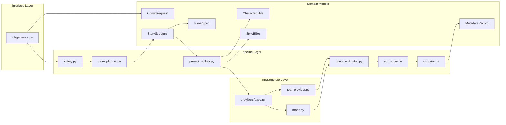

# Four-panel Comic Agent MVP

This project is a CLI-only MVP that turns a story theme into a four-panel comic package. It builds a fixed four-panel story, generates one prompt per panel, renders panel images through either `MockImageProvider` or `WanxImageProvider`, composes a final 2x2 comic image, and writes `metadata.json` for traceability.

`README.md` is a documentation deliverable. It describes the current product contract and contributor workflow, but it is not a runtime feature.

## What It Does

- Accepts a required comic theme or story idea.
- Accepts optional style, character, prompt-guidance, one global reference image, and provider selection.
- Accepts optional planner selection, with environment-controlled LM-assisted story planning enabled by default.
- Generates exactly four panels with caption, dialogue, scene description, action, emotion, camera/framing, and final image prompt.
- Produces four `512x512` panel PNG files and one `1054x1054` final comic PNG.
- Writes `metadata.json` with the request, story, prompts, provider details, image paths, warnings, and retry counts.

## Prepare the Project

Requirements:

- Python 3.11+
- `pip`

Install the project and development dependencies:

```bash
python3 -m pip install -e .[dev]
```

## Real Provider Setup

The project supports one real text-to-image provider today: `WanxImageProvider`.

Required environment variables for real-provider runs:

- `DASHSCOPE_API_KEY`

Optional environment variables:

- `DASHSCOPE_IMAGE_MODEL`
  - Defaults to `wan2.7-image`
- `DASHSCOPE_IMAGE_SIZE`
  - Defaults to `2K`

Example shell setup:

```bash
export DASHSCOPE_API_KEY="your-api-key"
export DASHSCOPE_IMAGE_MODEL="wan2.7-image"
export DASHSCOPE_IMAGE_SIZE="2K"
```

You can also place the same values in a repository-root `.env` file:

```dotenv
DASHSCOPE_API_KEY=your-api-key
DASHSCOPE_IMAGE_MODEL=wan2.7-image
DASHSCOPE_IMAGE_SIZE=2K
```

The CLI now loads `.env` automatically before provider initialization.

## LM-Assisted Planner Setup

LM-assisted story planning is enabled by default unless you disable it with an
environment variable. `--planner` still overrides the environment per run.

Required environment variables for manual LM-assisted runs:

- `COMIC_AGENT_LM_API_URL`
- `COMIC_AGENT_LM_API_KEY`
- `COMIC_AGENT_LM_MODEL`

Planner toggle environment variable:

- `COMIC_AGENT_LM_ENABLED`
  - Defaults to enabled when unset
  - Set to `false`, `0`, `off`, `disable`, or `disabled` to default back to `rule_based`

Optional environment variables:

- `COMIC_AGENT_LM_TIMEOUT`
  - Defaults to `20`

If LM-assisted planning is selected by default or requested explicitly but configuration is missing, the LM
storyboard payload is invalid, or the planning request is unavailable, the run
falls back automatically to the rule-based planner and records that fallback in
`metadata.json`. In LM-assisted mode, the model now produces one structured
four-panel storyboard JSON result, and the local pipeline continues with the
same prompt-building, validation, provider, and export steps.

Expected LM JSON shape:

```json
{
  "subject": "一只小兔子",
  "panels": [
    {
      "caption": "Morning",
      "dialogue": "小兔子 checks the morning plan.",
      "scene_description": "小兔子 stands at the front door with a school bag in clear morning light.",
      "action": "Take the first step out toward school.",
      "emotion": "eager",
      "camera_framing": "medium shot",
      "visual_description": "Show one doorway, one school bag, and one departure moment."
    }
  ]
}
```

The `panels` array must contain exactly 4 panel objects, and each panel must
describe one single-scene visual moment.

Additional LM validation rules:

- For `--lang zh`, LM storyboard field values must be written in Chinese.
- `subject` must not be a placeholder such as `Protagonist` or `main character`.
- `camera_framing` is normalized to a small canonical set:
  - `close-up`
  - `medium shot`
  - `wide shot`
  - `overhead shot`
  - `low angle`
  - `over-the-shoulder`
- Theme-specific semantic checks may reject off-topic storyboard expansions and
  automatically fall back to the rule-based planner.

## Panel Validation And Retry

Generated panel images are now validated before they are accepted into the
final comic. A provider can return image data successfully, but the pipeline may
still reject that image if it appears to violate the single-panel contract.

Current behavior:

- each panel attempt is validated after image generation
- invalid subdivided or storyboard-like outputs are rejected before composition
- the validator rejects both obvious dark divider grids and bright gutter-style internal panel splits
- the validator also uses a center-seam discontinuity heuristic to catch seamless 2x2-style stitched layouts even when no explicit panel border is drawn
- the pipeline uses a bounded retry strategy ladder for rejected attempts
- retries are tracked per panel in `metadata.json`

## Run the CLI

The CLI entrypoint is:

```bash
comic-agent generate --theme "<story idea>"
```

Basic example:

```bash
comic-agent generate \
  --theme "A shy cat learns to skateboard" \
  --out ./tmp/comic-output
```

Guided example with style, panel prompt, and reference image:

```bash
comic-agent generate \
  --theme "A frog builds a kite" \
  --provider wanx \
  --style "watercolor" \
  --character "small green frog with a yellow scarf" \
  --image-prompt "misty dawn, soft light, gentle storybook mood" \
  --panel-prompt-2 "dramatic close-up of the frog tying the kite frame" \
  --reference-image ./tmp/reference.png \
  --lang zh \
  --out ./tmp/comic-output
```

## CLI Arguments

Required:

- `--theme <text>`: comic theme or story idea

Optional:

- `--provider <mock|wanx>`: image provider selection, defaults to `wanx`
- `--planner <rule_based|lm_assisted>`: explicit story planner override; if omitted, the default comes from `COMIC_AGENT_LM_ENABLED`
- `--style <text>`: visual style, such as `manga`, `webtoon`, `pixel art`, `cinematic`, or `watercolor`
- `--character <text>`: main character description
- `--image-prompt <text>`: global prompt guidance applied to every panel prompt
- `--panel-prompt-1 <text>` through `--panel-prompt-4 <text>`: per-panel prompt guidance
- `--reference-image <path>`: one global reference image for the whole comic
- `--lang <code>`: output language marker, defaults to `zh`
- `--out <path>`: output directory; if omitted, the CLI creates a timestamped directory under `./output/`

Behavior notes:

- Missing per-panel prompt inputs are generated from the story and shared bibles.
- LM-assisted planning is enabled by default and falls back to the rule-based planner automatically if its output is invalid or unavailable.
- LM-assisted planning delegates storyboard expansion to the external API and then feeds the validated four-panel result into the same local prompt-building and image pipeline.
- Provider-facing panel prompts are now front-loaded with strict single-panel instructions so real-image runs emphasize "draw only this panel's scene" before style and consistency guidance.
- Set `COMIC_AGENT_LM_ENABLED=false` if you want the CLI default to stay local and deterministic.
- User prompt guidance is merged with generated prompts instead of replacing them.
- Unsafe theme input is rejected before story generation.
- Unsafe prompt guidance may be rejected or minimally rewritten, and rewrites are recorded in metadata.
- Real-provider runs validate environment configuration before the first generation request is sent.

## Expected Output Files

The output directory contains:

- `panel-1.png`
- `panel-2.png`
- `panel-3.png`
- `panel-4.png`
- `comic.png`
- `metadata.json`

Image contract:

- Each panel image is `512x512` PNG.
- The final comic is `1054x1054` PNG.
- The final comic uses a fixed 2x2 layout with a visible 10px outer border and 10px internal dividers.
- Captions and dialogue are stored in `metadata.json`; they are not rendered into the final image in this MVP.
- Each provider-facing panel prompt targets exactly one single-scene panel image; the pipeline explicitly instructs real providers not to generate a full comic page, extra sub-panels, or before-and-after sequences inside one panel output.

## metadata.json

`metadata.json` stores the normalized request and generated artifacts, including:

- request fields
- `character_bible`
- `style_bible`
- story title and premise
- four panel records
- per-panel `generated_prompt_base`
- per-panel `final_image_prompt`
- per-panel `prompt_source`
- per-panel `warnings`
- per-panel `retry_count`
- `reference_image_path`
- `provider`
- `provider_mode`
- `planner_run`
- `provider_run`
- `panel_attempt_traces`
- `panel_image_paths`
- `final_comic_path`
- top-level `warnings`

Current `prompt_source` values used by the implementation:

- `generated`
- `merged`
- `user_guided`

## High-level Design

Project structure:

- `src/comic_agent/cli/generate.py`: parses CLI arguments, validates inputs, runs the pipeline, and surfaces user-facing errors
- `src/comic_agent/models/`: data models for requests, panel/story data, bibles, and metadata
- `src/comic_agent/pipeline/story_planner.py`: uses an internal `StoryboardAgent` to expand simple themes into deterministic four-panel, shot-oriented story structures across day-in-the-life, seasonal, journey, problem-solving, competition-climax, and fallback themes
- `src/comic_agent/pipeline/story_planner.py`: also contains the LM-assisted storyboard boundary, environment-controlled default selection, strict JSON validation, and fallback orchestration
- `src/comic_agent/pipeline/prompt_builder.py`: builds `character_bible`, `style_bible`, and final per-panel prompts
- `src/comic_agent/pipeline/panel_validation.py`: validates generated panel images and defines bounded retry strategy progression
- `src/comic_agent/pipeline/safety.py`: rejects unsafe themes and rewrites unsafe or conflicting guidance
- `src/comic_agent/providers/base.py`: image provider interface
- `src/comic_agent/providers/mock.py`: deterministic placeholder image generator for tests and demos
- `src/comic_agent/providers/real_provider.py`: DashScope Wanx 2.7 text-to-image provider with environment-based configuration
- `src/comic_agent/pipeline/composer.py`: composes four panel images into the final `1054x1054` comic canvas
- `src/comic_agent/pipeline/exporter.py`: saves panel images, final comic image, and metadata
- `tests/unit/` and `tests/integration/`: unit and end-to-end coverage for the MVP pipeline

## MVP Boundary

This feature implements two provider modes:

- `MockImageProvider` for tests, demos, and credential-free runs
- `WanxImageProvider` for real text-to-image runs

What is included:

- provider interface
- deterministic mock image generation
- real text-to-image provider selection
- environment-variable-based real provider configuration
- reference-image path validation and metadata recording

What is not included yet:

- real image-to-image providers
- queue or background worker
- web UI
- database
- per-panel reference images

## Reference-image Handling

The MVP accepts one global `--reference-image`.

Current behavior:

- validates that the file exists
- validates the file type by suffix
- verifies it can be opened as an image
- stores the path in `metadata.json`
- marks panels as reference-guided internally so the mock output can label them as `REF`
- preserves the path in metadata for real-provider runs without turning it into a real image-to-image request

Current non-behavior:

- no real image-to-image transformation is performed
- the reference image is not analyzed for safety content
- no per-panel reference image inputs are supported

## Provider Selection And Testing Boundary

Provider selection:

- Omit `--provider` to use the Wanx real text-to-image provider
- Use `--provider mock` for credential-free mock runs

Planner selection:

- Omit `--planner` to follow `COMIC_AGENT_LM_ENABLED`; the default is `lm_assisted` when the variable is unset
- Use `--planner rule_based` to force the local deterministic planner for one run
- Use `--planner lm_assisted` to force one LM storyboard planning attempt before automatic fallback

Testing boundary:

- Automated tests should continue to use the mock provider or stubbed provider classes
- Automated tests should use mocked LM planner responses for LM-assisted coverage
- Automated tests should mock or stub panel validation outcomes when retry paths need to be exercised deterministically
- Automated tests must not require live credentials or paid provider access
- A manual real-provider smoke run is optional and depends on local credentials and network access

## Run Tests

Run the smallest relevant test commands:

```bash
pytest tests/unit/test_prompt_builder.py
pytest tests/unit/test_lm_story_planner.py
pytest tests/unit/test_layout_composer.py
pytest tests/unit/test_reference_image_validation.py
pytest tests/unit/test_metadata_export.py
pytest tests/unit/test_provider_config.py
pytest tests/unit/test_provider_selection.py
pytest tests/integration/test_mock_pipeline.py
python3 -m compileall src tests
```

For a full test run:

```bash
pytest
```


